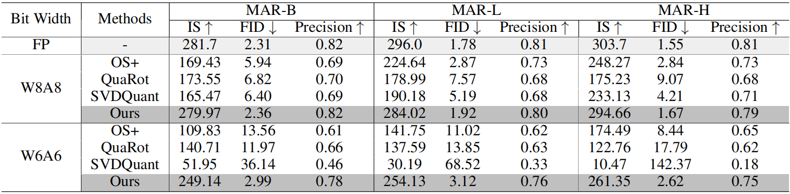

# MAR Code


### Pretrained Model
You need to download the pretrained models from the *[official MAR website](https://github.com/LTH14/mar)*, and place them in `/PATH/TO/YOU/`.


### Example: MAR-Base
```bash
cd MAR
```
0. Sample FP Images (Optional: for evalution)
```bash
python ./main_mar_sample.py --model_name mar_b --resume /PATH/TO/YOU/
```
1. Obtain Original Calibration
```bash
python ./main_mar_cali.py --model_name mar_b --resume /PATH/TO/YOU/
```
2. Get DGC Calibration
```bash
python ./main_mar_cali_dgc.py --model_name mar_b --resume /PATH/TO/YOU/
```
3. Quantize Model And Sample Quant Images
```bash
python ./main_mar_quant.py --model_name mar_b --resume /PATH/TO/YOU/
```

### implement
We use the global variable `globalvar` to access the calibration, so certain parts of the code need to be uncommented, as described in `main_mar_cali.py`. During quantization, we assign token-wise quantizers `TokenAwareUniformQuantizer` to layers affected by token-level variation. For layers with outliers, we first calculate scaling factors using GPS and then absorb them into the network weights to avoid additional computation during inference.


### Results

  <div align=center>
    
  </div>


