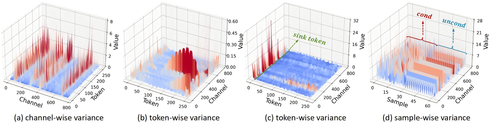
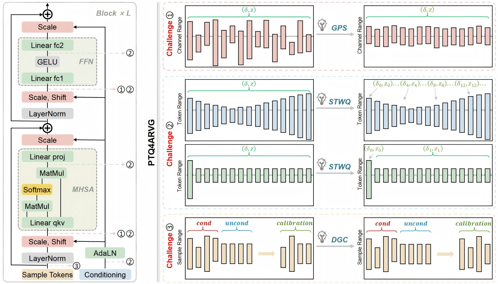
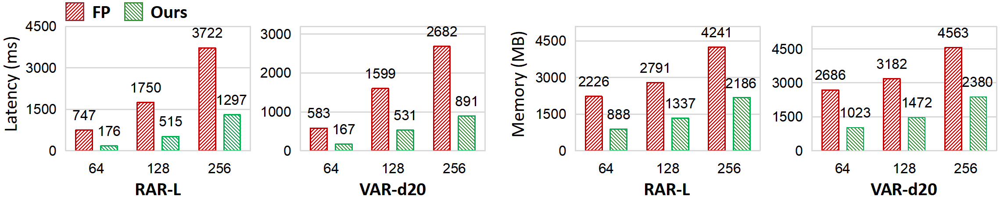
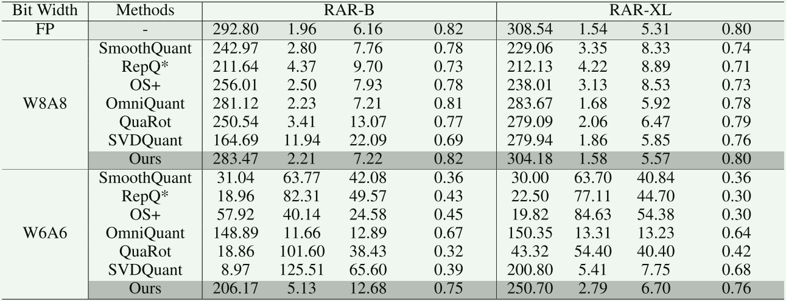
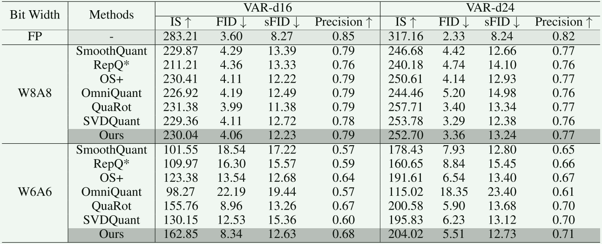
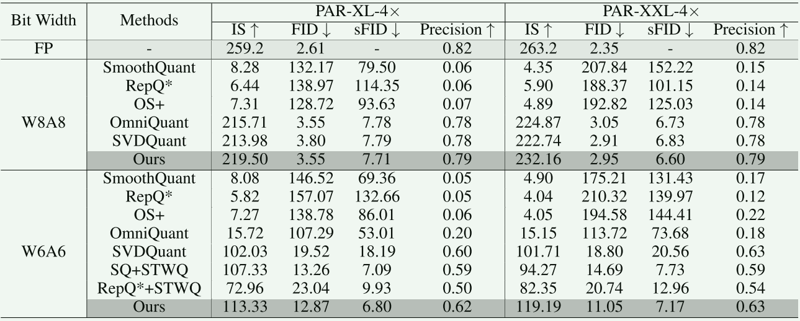

# 🚀PTQ4ARVG: Post-Training Quantization for AutoRegressive Visual Generation Models


<h5 align="center">

[](https://arxiv.org/abs/2601.21238)
[](https://github.com/BienLuky/PTQ4ARVG)
 <br>

</h5>

## 📖 Introduction
This repository contains the official PyTorch implementation for the paper
*"PTQ4ARVG: Post-Training Quantization for AutoRegressive Visual Generation Models".* Our study reveals the quantization challenges of AutoRegressive Visual Generation Models (ARVG) across the channel, token, and sample dimensions. Correspondingly, we propose PTQ4ARVG, a training-free and hardware-friendly PTQ framework tailored for ARVG models.

To the best of our knowledge, this work is the first to propose a theoretically supported scaling-based solution for handling outliers. It also represents the first complete PTQ framework specifically designed for ARVG models.
We hope our work will further advance the research and applicability of ARVG models.
<!-- Specifically, 
GPS derives the optimal scaling factor via differentiation to address channel outliers.
STWQ offline-assigns finer-grained quantization parameters to handle highly dynamic token activations.
DGC eliminate redundant samples based on distribution entropy to obtain a distribution-matched calibration. -->

🔹 Challenges
<div align=center>
  
</div>

🔹 Methods
<div align=center>
  
</div>


## 🔓 Getting Started

### 🗝️ Installation

Clone this repository, and then create and activate a suitable conda environment named `arvg` by using the following command:

```bash
git clone https://github.com/BienLuky/PTQ4ARVG.git
cd PTQ4ARVG
conda create --name arvg python=3.10
conda activate arvg
pip install -r requirements.txt
```

### 🔧 Usage

 - [RAR Code](RAR/README.md)
 - [VAR Code](VAR/README.md)
 - [PAR Code](PAR/README.md)
 - [MAR Code](MAR/README.md)

### 📝 Evalution
We provide a evalution script for reproducing the generation results on ImageNet-1K benchmark (the same as *[guided-diffusion](https://github.com/openai/guided-diffusion/tree/main/evaluations)*), where `/PATH/TO/YOU/NPZ/` refers to the .npz file containing the generated images. 
```bash
cd evaluation
wget https://openaipublic.blob.core.windows.net/diffusion/jul-2021/ref_batches/imagenet/256/VIRTUAL_imagenet256_labeled.npz
python ./evaluation/test.py ./evaluation/VIRTUAL_imagenet256_labeled.npz /PATH/TO/YOU/NPZ/
```

### 🛠️ Deployment
The quantized models are deployed by utilizing [CUTLASS](https://github.com/NVIDIA/cutlass) and the same deployment toolkit of [SmoothQuant](https://github.com/mit-han-lab/smoothquant). 
The specifical implementation is based on the open-source project [torch_quantizer](https://github.com/ThisisBillhe/torch_quantizer).


### 🖼️ Random samples 
  <details>
  <summary> RAR-XL (2.99× Acceleration)</summary>
  <div align=center>
    
  </div>

  **NOTE: Random samples of RAR-XL with 6-bit quantization.**
  </details>
  

  <details>
  <summary> VAR-d16 (2.92× Acceleration)</summary>
  <div align=center>
    
  </div>

  **NOTE: Random samples of VAR-d16 with 6-bit quantization.**
  </details>


### 📈 Speedup and Memory Saving
  <details>
  <summary> Deployment (RTX 3090 GPU)</summary>
  <div align=center>
    
  </div>

  **NOTE: Inference latency and peak memory usage are evaluated with a batch size of 100 across varying token sequence lengths.**
  </details>

### 📊 Main Results
  <details>
  <summary> RAR Results</summary>
  <div align=center>
    
  </div>

  **NOTE: Quarot experiments are excluded from RAR-XXL results as the model does not meet Quarot's requirements.**
  </details>
  

  <details>
  <summary> VAR Results</summary>
  <div align=center>
    
  </div>

  </details>

  <details>
  <summary> PAR Results</summary>
  <div align=center>
    
  </div>

  **NOTE: Quarot experiments are excluded from PAR results as the models do not meet Quarot's requirements.**
  </details>

  <details>
  <summary> MAR Results</summary>
  <div align=center>
    
  </div>

  </details>


## 📚 Citation

If you find [PTQ4ARVG](https://arxiv.org/abs/2601.21238) is useful in your research or applications, please consider giving us a star 🌟 and citing it by the following BibTeX entry.
```BibTeX
@misc{liu2026ptq4arvgposttrainingquantizationautoregressive,
      title={PTQ4ARVG: Post-Training Quantization for AutoRegressive Visual Generation Models}, 
      author={Xuewen Liu and Zhikai Li and Jing Zhang and Mengjuan Chen and Qingyi Gu},
      year={2026},
      eprint={2601.21238},
      archivePrefix={arXiv},
      primaryClass={cs.CV},
      url={https://arxiv.org/abs/2601.21238}, 
}
```

## 💙 Acknowledgments

The development of PTQ4ARVG is based on [RepQ-ViT](https://github.com/zkkli/RepQ-ViT) and [SmoothQuant](https://github.com/mit-han-lab/smoothquant). We deeply appreciate their contributions to the community.

